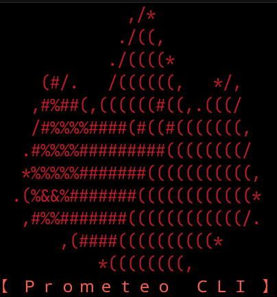

# Prometeo CLI

This tool was developed during a hackathon promoted by the Ignite Community.

The challenge was to develop a CLI that could interact with the Prometeo Open Banking API.

## Running it

### Downloading the binaries

Get them from [Releases](https://github.com/system32uwu/prometeo-cli/releases/tag/1.0.0), the `exe` file is for Windows while the other is for `GNU/Linux`, or as I've recently taken to calling it, **GNU plus Linux**.

### Building the binaries

Make sure you have rust installed in your system, if you don't, get it from [here](https://www.rust-lang.org/tools/install).

#### For host OS

You can simply run `cargo build -r`

#### For any other OS

Check out [cross](https://github.com/cross-rs/cross)

For example, as my host OS is Arch Linux (btw), I had to use the following command to make a build for Windows:

`cross build --target x86_64-pc-windows-gnu`

## On GNU plus Linux

- `chmod +x prometeo-cli`
- `./prometeo-cli`

## On Windows

`./prometeo-cli.exe`

## Features

#### Auth

- Login
- Log Out

#### Config

- Set API key

#### Meta

- List providers

#### Transactional Data

- Accounts
- Credit Cards

## Tech stack

#### Rust

##### Why?

Every developer should have at least one project written in Rust otherwise you're irrelevant

##### Crates used:

- reqwest: makes requests
- tokio: asynchronous support for rust
- dialoguer: those nice menus you saw
- colored: adds colors to the displayed messages
- serde: for serialization
- serde_json: for json support
- jfs: abstraction to read and write json to the filesystem
- dirs: cross-platform directories (such as `~/.config` or `/home/${username}`) 

#### JSON

You can store things with it, gets the job done. Storing data such as  `api_key`, `user_key` and `username` seems convenient, although a safer approach might be preferable.

## Demo

(Click on the image to see the a demo)

## Reference

[Ignite Community](https://joinignitecommunity.com/)

[Challenge](https://joinignitecommunity.com/desafio-cli/)
